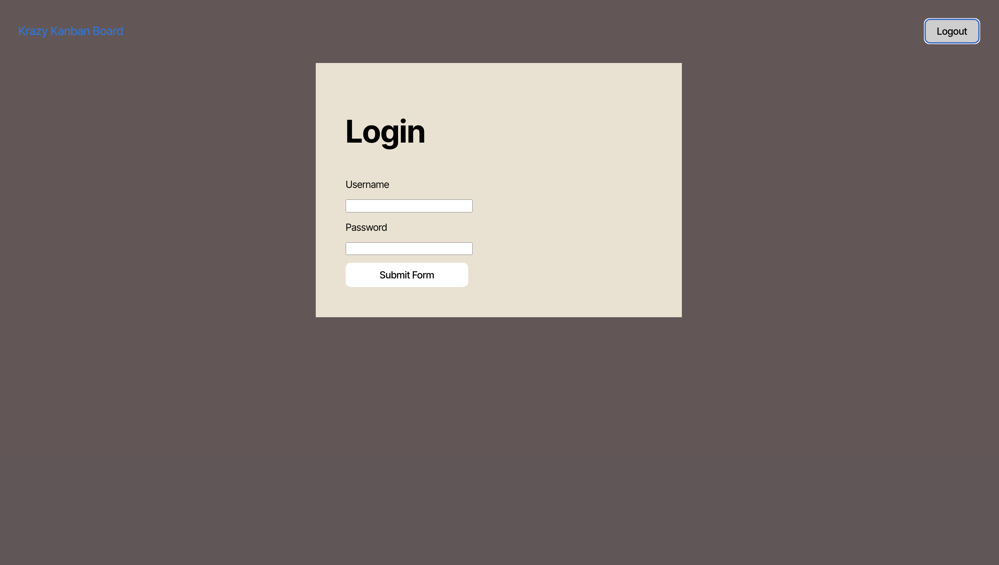
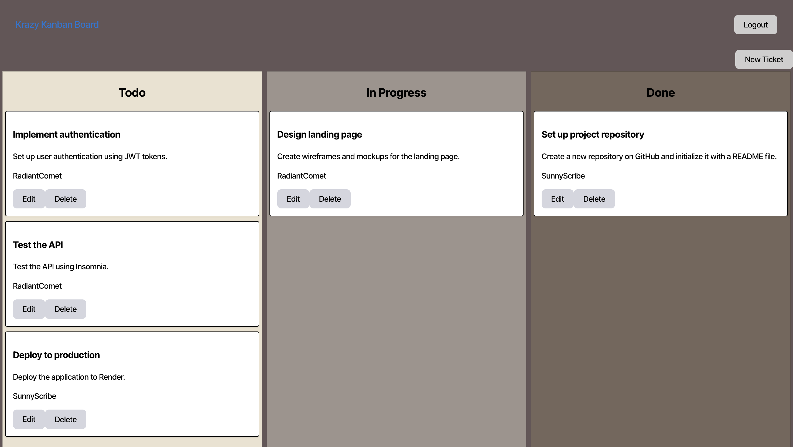
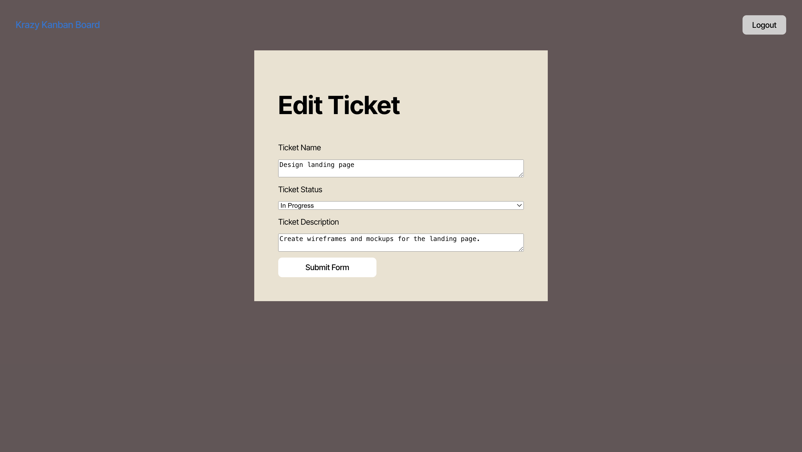
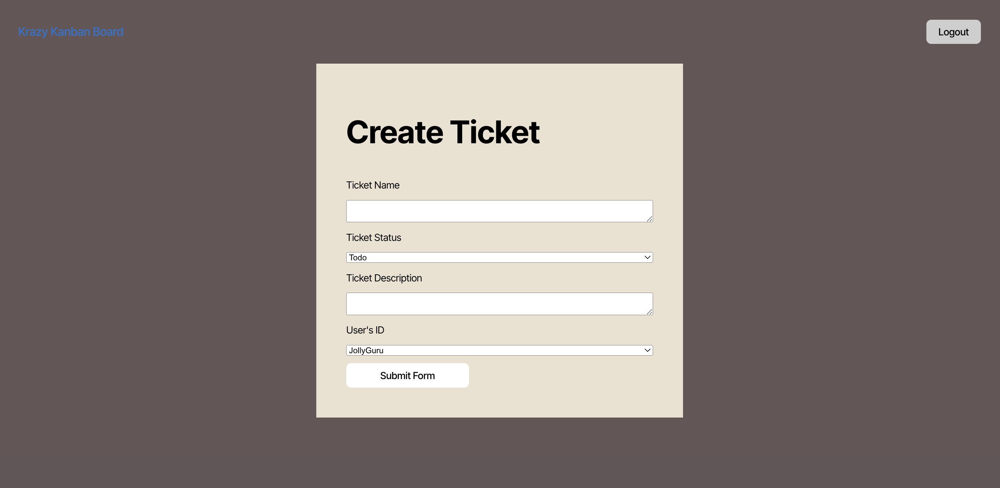

# Kanban Board
This is a Kanban Board application that enhances an existing Kanban board by adding authentication and session management using JSON Web Tokens (JWT). With this implementation, users can securely log in to access the Kanban board, and their session is maintained until they log out or their session expires. This protects the board from unauthorized access, and only authenticated users can make changes.

You can click to view the live site [here](https://kanban-board-wgq8.onrender.com) on Render. 

## Table of Contents
* [Features](#features) 
* [Installation](#installation)
* [Usage](#usage)
* [License](#license)
* [Contributing](#contributing)
* [Contact Information](#contact-information)

## Features
* A secure login page that requires a valid username and password for authentication.
* JWT authentication to securely manage user sessions with the server API.
* Utilizes a PostgreSQL database to securely store user data.
* Redirection to the Kanban board after a successful login.
    * Within the Kanban board, users can create, edit, or delete tickets that are displayed in the To Do, In Progress, and Done columns.
* Automatic session expiration after a defined period of inactivity for enhanced security.

Home Page

Login Screen

Kanban Board

Edit Ticket

Create Ticket


## Installation
For this app you will need to 
1. Fork the repo to your local machine
2. Install the necessary dependencies using: 
```
npm install
```
3. Create the postgreSQL database
4. Build the project 
```
npm run build
```
5. Run the seed data file:
```
npm run seed
```

## Usage
This app enables users to securely log in and access their Kanban board. Once authenticated, users can Create, Edit, and Delete tickets, as well as manage tasks across the To Do, In Progress, and Done columns.

## License
This project is licensed under the ISC license.

## Contributing
Contributions welcome for this project! Feel free to fork the repository, make your changes, and submit a pull request.

## Contact Information
* GitHub: celeste-hayes